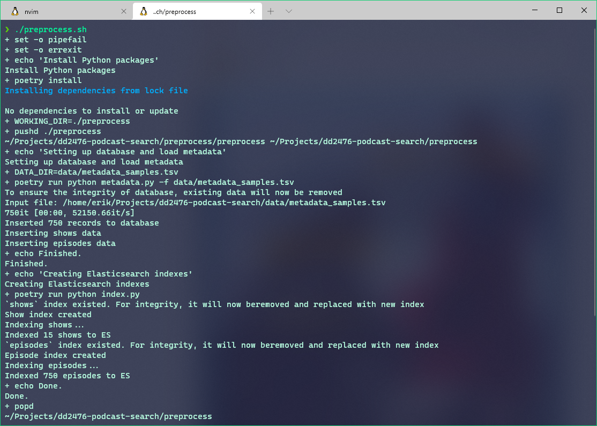

# Spotify Podcast Search

Group project for DD2476 - Search Engines and Information Retrieval @ KTH Royal Institute of Technology

Contributors:
- Caroline Larsen
- Cuong Duc Dao
- Kalle Petterson
- William Lindblom
- Xitao Mo

## Note
[04-23-2021] As we have upgraded our codebase to use Java as the main language for the backend and data import, you need to perform the following steps to properly setup your local data.
- Make sure you've run `docker-compose up -d` successfully
- Run `./clean.sh`: this will delete the old database and create a new one, and it'll also delete the index
- Run `cd backend && ./run.sh` to start the backend server

## Project structure

_Note: The structure is pretty much a ongoing work, subjected to changes as the project progresses._

- [`data`](./data): this directory contain all the data needed for this project. Due to the huge size of dataset we have for this project, only a subset of data is pushed to GitHub. For more details on how to structure the dataset on your machine, see the instructions inside this directory.
- [`docs`](./docs): contains necessary information to setup, install and run the search engine, backend, frontend, etc. for this project
- [`analysis`](./analysis): contains exploratory analysis of the dataset.


## Setup

**Docker**:
- Depending on what OS you're using on the computer, consult the official Docker installation documentations for more details ([MacOS](https://docs.docker.com/docker-for-mac/install/) or [Windows](https://docs.docker.com/docker-for-windows/install/))
- After you've got Docker installed, try to run `docker-compose up -d` inside this repo, if you get the following outputs, everything is properly setup
```
Starting elasticsearch ... done
Starting postgres      ... done
Starting kibana        ... done
```

**Poetry**:
Poetry is a package and virtual environment management tool for Python. It helps isolate the python environment for this project (i.e., the one inside the `analysis` directory) from potential conflicts with whatever python is currently installed in your system.
- Follow the official installation instructions [here](https://python-poetry.org/docs/#installation) to get it setup.

## Preprocess

The current preprocess script read the shows and episodes **metadata** from a `.tsv` file and put them into the PostgreSQL database as well as Elasticsearch index for further analysis and manipulation. To run the preprocessing script, make sure you complete setting up Docker and poetry, then run
```shell
docker-compose up -d
cd preprocess && ./preprocess.sh
```

If everything work properly, your console/shell screen should look like below

